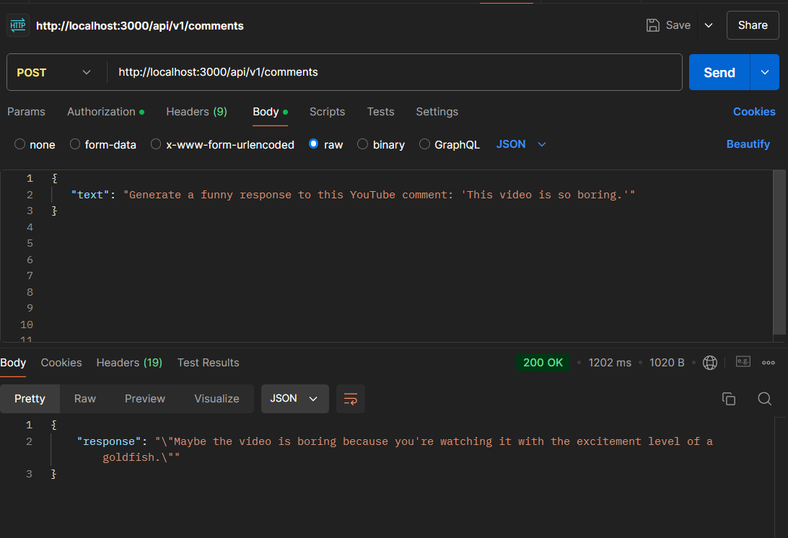
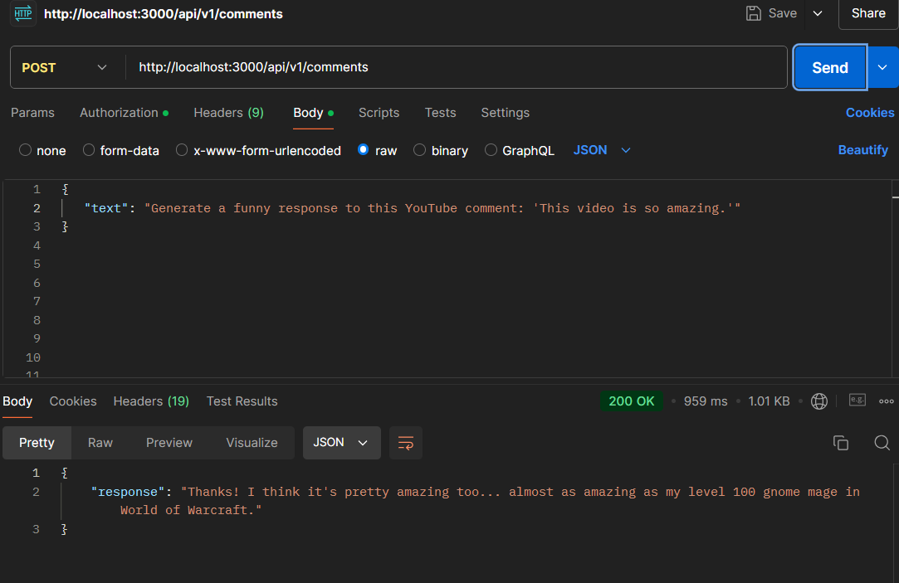

# AI comment generator

The comment:

"Generate a funny response to this YouTube comment: 'This video is so boring.'"

The result:

The comment:

"Generate a funny response to this YouTube comment: 'This video is so amazing."

The result:

